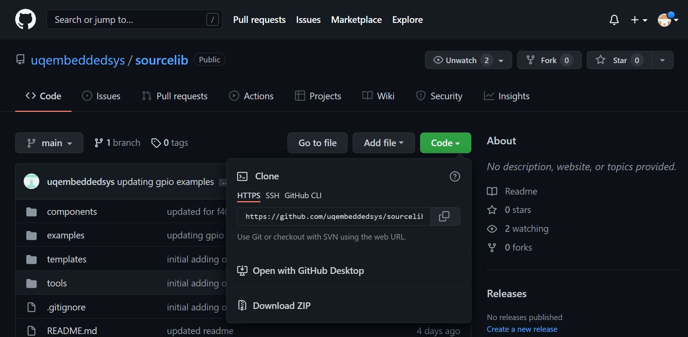

# CSSE3010 Git Guide

Note this guide is for Linux, OSX and Windows. You will find Windows specific instructions, below.

Use Git to manage your development. Benefit: Git is an distributed repository that you can use to keep track of your current code history and use for backup purposes. You can check in changes when you need to, not just when you are connected to the Internet. This means that your git history will be more like a “workbook” or diary of your progress.

There are 2 repositories you will need for this course 

* 'sourcelib' - this contains all the necessary drivers needed to compile your code, as well as programming examples, Makefiles, compiling tools, flashing tools, and debugging tools. This repository is public, available to everyone, you will only be pulling from this repository. You can find the repository here [https://github.com/uqembeddedsys/sourcelib](https://github.com/uqembeddedsys/sourcelib), you will clone it further on in this guide.
* 'repo' - This is where you will commit your code, any libraries you develop, stage code, and project code goes here.

This document contains instructions on the following procedures:

* Setting up your git account
* Initialising the repository locally (Do this the first time only)
* Public Key Generation (For automatic authentication)
* Cloning your online repository
* Adding a .gitignore file (Do this once only)
* Committing changes (Each time an element of work is done)
* Synchronizing your local repository with the online repository (after each stage/project) 
* Summary
* Using the Git Command Line Interface (CLI)
* Troubleshooting


---
## Task 1: Setting up your git account
Access to your gitea account is via your UQ login, using single sign on (SSO).
Browse CSSE3010 gitea using the URL: [https://csse3010-gitea.uqcloud.net/](https://csse3010-gitea.uqcloud.net/). Once logged in, you will see one empty 'repo' repository under your student number.

|  |
|:--:|
| *Figure 1: Logging into CSSE3010 Gitea for the first time* |

This is your repo, all the code you write will be pushed here, all testing from projects and stages will be done by pulling from this repo.

---
## Task 2: Public Key Generation via Command Line (Linux)
You will need to generate a public and private key pair. The public key will need to be uploaded to your Gitea account. This will allow your local git to be automatically authenticated to your online git account. Open a terminal (in your VM, if used) and type the following commands:

- Generate key pair: `ssh-keygen`  
- Add the key to the ssh-agent `ssh-add ~/.ssh/id_rsa`  
- Display public key generated above: `cat ~/.ssh/id_rsa.pub`  

NOTE: press `<enter>` when asked for file location and pass-phrase. If you get asked if you want to overwrite the previous key, say 'yes'. 

You now need to link the public ssh key to your gitea account. Open gitea in your browser and navigate:

Profile and Settings (Top Right Button) -> Settings -> SSH / GPG Keys -> Manage SSH Keys -> Add Key

The url for the SSH settings should be [https://csse3010-gitea.uqcloud.net/user/settings/keys](https://csse3010-gitea.uqcloud.net/user/settings/keys)
Copy the contents of `cat ~/.ssh/id_rsa.pub` into the "Content" section.

NOTE: For VirtualBox users, make sure “clipboard, bidirectional” is enabled, this will help you copy+paste things between your Host OS and VM.

### Public Key Generation for Windows
Install [putty](https://www.putty.org/)
Follow the steps on this [guide](https://phoenixnap.com/kb/generate-ssh-key-windows-10#ftoc-heading-6)

---
## Task 3: Git Configuration
You will need to initialize your git configuration and set up your global user name and user email. This is required to ensure that you can commit to your local repository. Open a terminal (in your VM, if used) and execute the following commands:

```
git config --global user.name "<MY.NAME>"
git config --global user.email MY.EMAIL@student.uq.edu.au
```

NOTE: `<MY.NAME>` eg. “joe student”.

user.name is the name that will come up under your commit logs, user.email will link your git agent to your git-ea account.

<!-- **If you're using your own Linux machine (NOT THE CSSE3010 VIRTUAL MACHINE)}, you will also need to set up a local csse3010 directory under your home directory for later tasks. NOTE: The csse3010 folder must be set up under the home directory in order for important environment variables to work properly. Refer to the mylib guide for the full folder hierarchy.**  -->

---
## Task 4: Cloning Sourcelib


<!-- ** If you're bring your own Linux environment instead of the CSSE3010 Virtual Machine, you will first need to clone the *sourcelib* repository into your csse3010 folder. Virtual Machine users will already have *sourcelib* cloned in the csse3010 folder. *sourcelib* contains example programs to help you get started on the Nucleo platform, as well as configuration and library files for the onboard MCU. **   -->

Execute the following commands:  
- Change into home directory: `cd ~`  
- Create a folder called csse3010: `mkdir csse3010`  
- Change into your csse3010 directory: `cd ~/csse3010`    
- Clone the remote sourcelib repository into your csse3010 folder. This will automatically create a folder called sourcelib:  
`git clone  https://github.com/uqembeddedsys/sourcelib.git`  


||
|:--:|
|*Figure 2: Git URL for cloning sourcelib*|

## Task 5: Cloning Repo

Navigate to 'repo' in gitea, select 'SSH', and copy the ssh url

||
|:--:|
|*Figure 3: Git URL for cloning repo*|

`cd ~/csse3010`  
`git clone <copied url>` e.g. `git@csse3010-gitea.zones.eait.uq.edu.au:12345678/repo.git`

There should now be 2 folders in `~/csse3010`, `repo` and `sourcelib`.

You have now completed your local repository setup. You can now use git to commit your files. Note that committing files only stores files locally. It DOES NOT synchronise your local Git repository with your online repository.

When using git, you can graphically see the current history by running gitg.

NOTE: If you are working from home, you MUST be connected to the UQ VPN to be able to use git remotely, see the [UQ VPN Guide](https://my.uq.edu.au/information-and-services/information-technology/working-remotely/vpn-virtual-private-network)

NOTE: There WILL be updates to `sourcelib` throughout the semester, make sure you keep it up to date by `cd ~/csse3010/sourcelib` `git fetch` `git pull`, do this often.

NOTE: there are two labels in your gitg window, a `master` branch and a `origin/master` branch. The `master` branch is on your local repository, and all branches prefixed with `origin/` are on the remote server (CSSE3010 gitea).

NOTE: You will only commit files to the `repo` repository.


## Task 6: Staging and Pushing Files
Under normal development, you can use git to stage files, and commit them to your repository. 

Make a commit now by updating the `README.md` file in your `repo`, if there is no README.md file, you can create one with `touch README.md`.

Open the file with a text editor. e.g. `code README.md`, change the title to `<Student#> 3010 Repo`, e.g. `42345678 3010 Repo`, save the file and close it. Open a terminal in the `repo` folder.

```
git status
git add README.md  
git commit -m"updated README"  
git push -u origin master  
```
||
|:--:|
| *Figure 4: git commit example*|


Doing a git commit will create a commit in your local repository. Doing a git push will push the commit to your remote repository on gitea. You can do several git commits before doing a git push, if you so wish.


Figure 5 shows the revised history after this commit.

||
|:--:|
| *Figure 5: gitg commit history*|

---
## Summary of Important Commands

- check curret repo status `git status`
- view history: `gitg`
- commit files: `git add`, `git commit` 
- To get the latest changes from the online repository: `git fetch`, `git pull`
- To push all your local commits to the online repository: `git push` (or `git push -u origin master` if pushing for the first time to an empty remote repository)  
- If you are recovering from a HDD failure, use the commands in the original guide `git clone <URL>`

---
## Other tips
Commit changes regularly.

You will be required to put your changes into the online Gitea (AT LEAST) after each assessment, every session, including stage, project, etc.

---

## Troubleshooting

** Error: "Could not resolve hostname `https://csse3010-gitea.uqcloud.net/`: No address associated with host" **  

This URL should have been copied directly from the gitea web interface. Typing this manually has the potential to cause typos to exist.  
This problem may be caused by your VM not being connected to the Internet.  
- Make sure your computer (the “host”) is connected to the Internet.  
- Make sure you are connected to UQ VPN  
- Reboot your VM.  
- `ping 8.8.8.8` - make sure you are getting packets  
- `ping github.com` - make sure DNS works ([fix](https://stackoverflow.com/questions/9393409/ssh-could-not-resolve-hostname-github-com-name-or-service-not-known-fatal-th))  
- `ssh-add -l` check the ssh-key is listed in the ssh-agent, also check the fingerprint of the key matches the fingerprint in gitea  
- If all else fails, prepend `GIT_SSH_COMMAND="ssh -vv"` before the git command, e.g. `GIT_SSH_COMMAND="ssh -vv" git clone -v git@csse3010-gitea.zones.eait.uq.edu.au:41234567/repo.git`, then paste the output in Ed.


** Error: Unable to do a git pull **

"Your local changes to the following files would be overwritten by merge: Please, commit your changes or stash them before you can merge. Aborting"

Reset your git and completely overwrite your local changes - NOTE: ALL YOUR CHANGES WILL BE DELETED AND REPLACED BY THE ONLINE GIT FILES. Run the following commands:

```
git reset HEAD --hard 
git pull
```

Alternatively 

```
git stash
git pull
git stash pop
<fix any merge conflicts>
git commit
```
