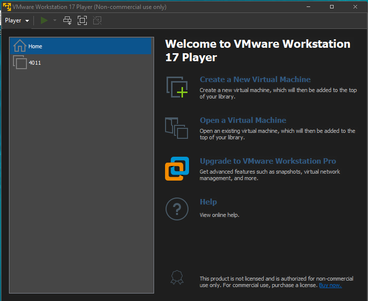

# Virtual Machine Setup Guide

* CSSE3010 Linux Virtual Machine (VM) Requirements
* Install CSSE3010 VM on VMware Player Pro (Windows)
* Install CSSE3010 VM on VirtualBox (OSX or Windows)  

# Linux Virtual Machine Requirements
You will require at least 16GB of hard-disk space, to install the VM. The Following Virtual Machines are recommended or the following operating systems:

* Windows: VMWare Player (preferred) or Virtual Box (alternate)
* OSX: Virtual Box or VMWare Fusion

# Virtual Box Installation: (Windows, OSX and Linux)

* Download the [Virtual Box](https://www.virtualbox.org/) installer and VM disk image file (.ova). Copy both to your hard drive. 

## Step 1
Install virtual box and open, when installeed

## Step 2
Select and drag the VM .ova file into the virtual box manager. This will create a new CSSE3010 VM.

## Step 3
Double click the CSSE3010 VM icon, to start the CSSE3010 VM. This should take you to the desktop, as seen below.

## Step 4
Your Virtual Machine should now boot to the deskotp.

|  |
|:--:|

# VMware Workstation Player Installation: (Windows only)

* Download the VMWare workshop player installer and VM disk image file (.ova).

* You can choose to download the latest VMware workshop player/ 

* Install VMWare workshop player on your laptop.

## Step 1
Use the "Open a Vritual Machine" link and select the CSSE3010VMxx.ova file.

|  |
|:--:|

## Step 2
Follow the prompts, to install the CSSE3010 VM. Set CSSE3010 to the VM name. Select ok or retry, when encoutering warnings.

## Step 3
When finished installing, double click the CSSE3010 link on the VMware workstation player, to boot the CSSE3010 VM.

## Step 4
Your Virtual Machine should now boot to the deskotp.

|  |
|:--:|

