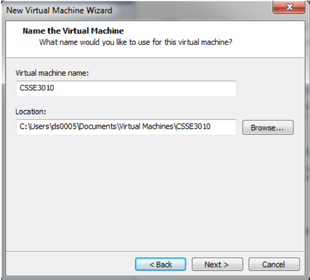
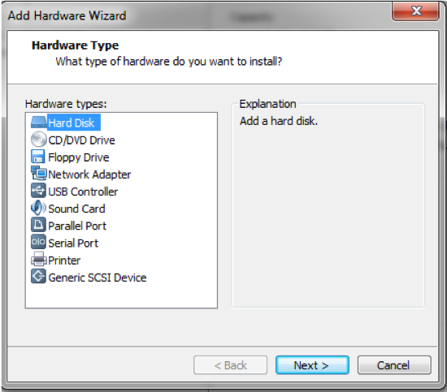
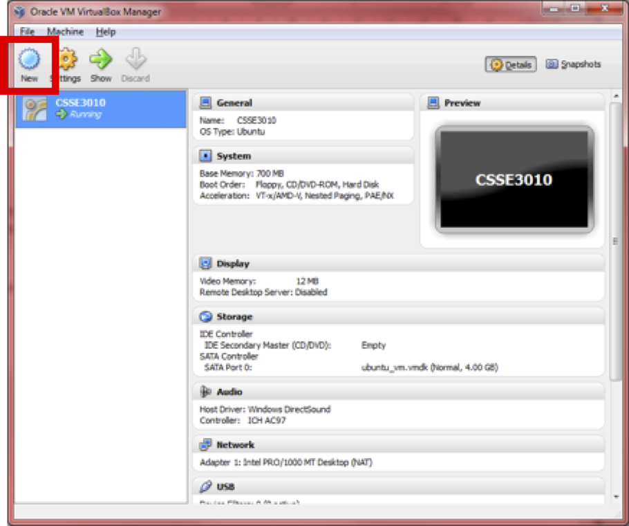

# Virtual Machine Setup Guide

* CSSE3010 Linux Virtual Machine (VM) Requirements
* Install CSSE3010 VM on VMware Player Pro (Windows)
* Install CSSE3010 VM on VirtualBox (OSX or Windows)  

# Linux Virtual Machine Requirements
You will require at least 8GB of hard-disk space, to install the VM. The Following Virtual Machines are recommended or the following operating systems:

* Windows: VMWare Player (preferred) or Virtual Box (alternate)
* OSX: Virtual Box or VMWare Fusion

# VMware Player Pro Installation: (Windows)

* You will be provided with a folder or links containing the VMWare workshop player installer and VM disk image file (.VDMK). Copy both to your hard drive. 

* You can choose to download the latest VMware workshop player/ 

* Install VMWare workshop player on your laptop.

## Step 1
You will now need to install the CSSE3010VM.VDMK file as a hard drive.

Click, create a new virtual machine

|  |
|:--:|
| *Click, create a new virtual machine* |

## Step 2
In new virtual machine wizard, select "I will install the operating system later.". 

\includegraphics[width=0.7\textwidth]{images/Picture2.png}
|  |
|:--:|

## Step 3
In "guest operating system", select Linux and set the "Version" to be Ubuntu click next.

|  |
|:--:|

## Step 4
Set the "Virtual machine name:" to be CSSE3010VM. 

|  |
|:--:|

## Step 5
Set the "Maximum disk size" to be 20GB. Select the "Store virtual disk as a single file". 

|  |
|:--:|]

## Step 6
Check your settings are correct and click finish.

|  |
|:--:|

## Step 7
Select "CSSE3010VM", under "Home", in the main portal and click "edit virtual machine settings". 

|  |
|:--:|

## Step 8
Select the “Hard Disk (SCSI) 20GB”

* Click “Remove” (The 20GB Hard Drive MUST BE REMOVED before proceeding)
* Click "Add" and continue to step 13)

|  |
|:--:|

## Step 9
Select "Hard disk", in "Hardware types". 

|  |
|:--:|

## Step 10
Select “SCSI”. 

|  |
|:--:|

## Step 11
Select "use an existing virtual disk" in "Select a disk". Click Next.

|  |
|:--:|

## Step 12
Click Browse and select your CSSE3010vm.vdmk file. Click Finish.

|  |
|:--:|

## Step 13
 Now click "play virtual machine".
 
|  |
|:--:|

## Step 14
Your Virtual Machine should now boot.

|  |
|:--:|
 

# VirtualBox Installation: (OSX or Windows)

* You will be provided with a folder containing the VirtualBox installer and VM .VDMK file image. Copy both to your hard drive.
* Install VirtualBox on your laptop.
}
Next we are going to set up a new machine to run our Linux VM in by clicking ‘New’ up in the top left menu bar.

|  |
|:--:|

## Step 1
Click Next, input the name as ‘CSSE3010’ and select your OS as Linux, version Ubuntu and then click Next. SELECT OPERATING SYSTEM: LINUX and VERSION: UBUNTU-64bit

|  |
|:--:|

## Step 2
Now you have to set the amount of RAM to be allocated to the VM, 512MB is a good base. Hit Next.

|  |
|:--:|

## Step 3
We will select the start-up hard disk for the system to be the provided .vmdk file.  This file will set up your VM to have all of the libraries, programs and other necessary files already set up.  Click ‘Use existing hard disk’ then click the browse button as highlighted.  Then navigate to and Open the ubuntu_vm.vmdk  provided.

|  |
|:--:|

## Step 4
Your new machine should now appear in the VirtualBox main window, double click the icon to boot it up.  Click OK through the dialogs that open and if prompted, log in as ‘csse3010 with password ‘csse3010.  You should now see a desktop screen similar to this:

|  |
|:--:|